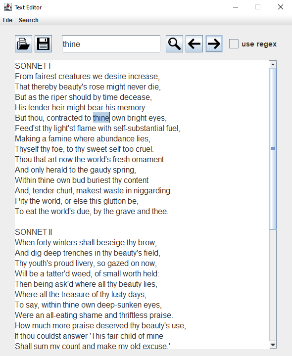

# Text Editor

## Table of Contents
1. [Basic Info](#Basic-Info)
2. [Functionality](#Functionality)
3. [Architecture](#Architecture)
4. [Screenshots](#Screenshots)
5. [License](#License)

## Basic Info

This program is a simple text editor which supports working with files and text search.

| Parameter                               | Data                                             |
| :-------------------------------------: | :----------------------------------------------: |
| Program name:                           | Text Editor                                      |
| Date of creation:                       | January 2022                                     |
| Technologies used:                      | Java SE                                          |
| Time spent to   create the program: | ~10 hours                                        |
| Author:                                 | Herman Ciechanowiec   herman@ciechanowiec.eu |
| License:                                | MIT No Attribution License                       |

## Functionality

The program allows to:
- edit text
- open text from a file
- save text to a file
- perform usual text search
- perform regex text search

## Architecture

The program is divided into three parts: front-end (graphical user interface), back-end (logic of the program) and the controller, which handles a relationship between the front-end and the back-end:   

## Screenshots
 
 
 
 
 
 

## License
The program is subject to MIT No Attribution License

Copyright © 2022 Herman Ciechanowiec

Permission is hereby granted, free of charge, to any person obtaining a copy of this
software and associated documentation files (the "Software"), to deal in the Software
without restriction, including without limitation the rights to use, copy, modify,
merge, publish, distribute, sublicense, and/or sell copies of the Software, and to
permit persons to whom the Software is furnished to do so.

THE SOFTWARE IS PROVIDED "AS IS", WITHOUT WARRANTY OF ANY KIND, EXPRESS OR IMPLIED,
INCLUDING BUT NOT LIMITED TO THE WARRANTIES OF MERCHANTABILITY, FITNESS FOR A
PARTICULAR PURPOSE AND NONINFRINGEMENT. IN NO EVENT SHALL THE AUTHORS OR COPYRIGHT
HOLDERS BE LIABLE FOR ANY CLAIM, DAMAGES OR OTHER LIABILITY, WHETHER IN AN ACTION
OF CONTRACT, TORT OR OTHERWISE, ARISING FROM, OUT OF OR IN CONNECTION WITH THE
SOFTWARE OR THE USE OR OTHER DEALINGS IN THE SOFTWARE.
